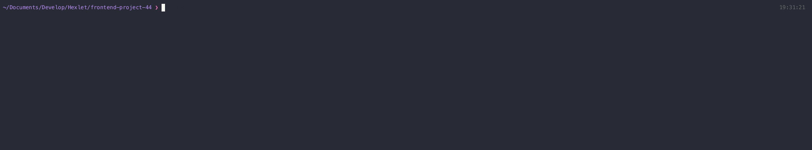

### Hexlet tests and linter status:

Project name: 'BRAIN GAMES'.

Description: a set of simple games played through terminal.

Use the latest versions of JS and utilities available.

Instructions:

1. Run 'npm install'.
2. Choose a game, start it with a corresponding command listed in 'package.json'.
3. Follow the instructions.
   _Good luck!_

EXAMPLES:

'Parity Check':

_Allows user to guess if the given number if even._

'Calculator':

_A simple calculator that allows to sum, subtract or multiple two numbers._

'Greatest Common Divider':

_Allows user to guess the Greatest Common Divider (GCD) of the given numbers._

'Arithmetic Progression':

_Allows user to guess the missing number in a given progression._

'Prime Number Check':

_Allows user to guess if the given number is prime or not._

